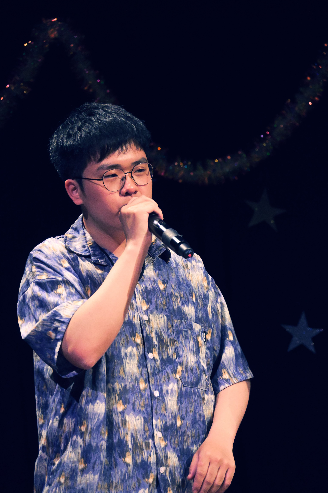

# 👋 Hi, I'm Shuhan Zhang

My name is **Shuhan Zhang**, and I’m a third-year undergraduate majoring in Data Science at The Chinese University of Hong Kong, Shenzhen. In 2025, I studied as a visiting student at the University of Pennsylvania and conducted summer research at UT Austin. Advised by [**Prof. Shuang Li**](https://shuangli01.github.io/) and [**Prof. Rui Gao**](https://faculty.mccombs.utexas.edu/rui.gao/index.html), I’ve worked on interpretable and context-based choice models, as well as theoretical research in reinforcement learning. Our works are published at **ICLR 2025** and selected as an oral at the **ICML 2025 MoFA Workshop**. I’m currently preparing to apply for PhD programs in Fall 2026.

---

## 🎓 Education

**The Chinese University of Hong Kong, Shenzhen**  
*B.S. in Data Science* · Sept 2022 – May 2026  
GPA: 3.9/4.0 · Dean’s List (2022–2024)
Courses: Mathematical analysis, Stochastic Processes, Advanced Probability Theory

**University of Pennsylvania (Visiting Student)**  
*Jan 2025 – May 2025*  
GPA: 3.9/4.0  
Courses: Bayesian Data Analysis, Numerical Optimization, Game Theory

---

## 🔬 Research Experience

**Summer Research Intern** · UT Austin · May 2025 – Present  
- Theoretical research on policy optimization in reinforcement learning  
- Designing provably efficient algorithms under function approximation

**Undergraduate Research Assistant** · CUHKSZ · Mar 2024 – Present  
- Developed logic-based discrete choice models for interpretable preference learning  
- Built deep learning models to capture context and interaction effects in decision-making

**Undergraduate Research Assistant** · Shenzhen Research Institute of Big Data · Apr 2024 – Present 
- Applied XGBoost and PC-MCI to detect financial fraud  
- Worked on graph transformer models for logistics forecasting

---

## 📝 Publications

- **Logic-Logit: A Logic-Based Approach to Choice Modeling**  
  *Shuhan Zhang*, Wendi Ren, Shuang Li  
  *ICLR 2025 (Poster)*  
  [OpenReview](https://openreview.net/forum?id=vJgJSrYPe1)

- **Deep Context-Dependent Choice Model**  
  *Shuhan Zhang*, Zhi Wang, Rui Gao, Shuang Li  
  *ICML 2025 MoFA Workshop (Oral 10%)*

## 📫 Contact

- 📧 shuhanzhang@link.cuhk.edu.cn | zhang19@sas.upenn.edu 
- 📍 Shenzhen, China  
- 📄 [My CV](./CV.pdf)

